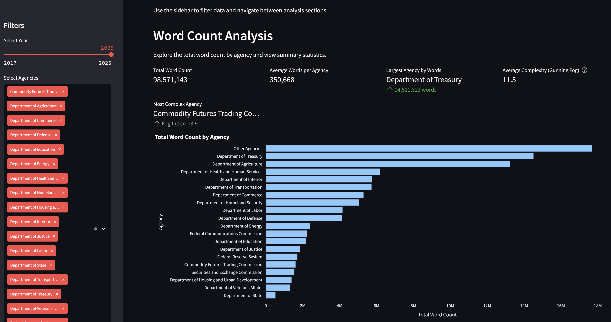

# Federal Regulations Analysis Pipeline

A Python-based tool for downloading, analyzing, and creating semantic search capabilities for federal regulations from the Electronic Code of Federal Regulations (eCFR).


*Federal Regulations Analysis Dashboard showing word count analysis and agency comparisons*

## Overview

This pipeline automates the process of:
1. Downloading regulations from the eCFR API
2. Processing and analyzing text metrics (readability, complexity, etc.)
3. Generating embeddings for semantic search
4. Creating a FAISS index for efficient similarity search
5. Generating visualizations and statistical analyses

## Features

### Data Collection & Processing
- **Automated Data Collection**:
  - Downloads regulations from multiple federal agencies
  - Handles nested agency hierarchies
  - Preserves document structure
  - See [Chunking Documentation](docs/Chunking.md) for processing details
  
- **Text Analysis**:
  - Readability metrics (Flesch Reading Ease, Flesch-Kincaid, etc.)
  - Text complexity analysis
  - Statistical summaries
  - See [Readability Metrics Documentation](docs/ReadabilityMetrics.md)
  
- **Semantic Search**:
  - Vector embeddings for efficient similarity search
  - FAISS indexing for fast querying
  - Metadata-enriched search results
  - See [Search Documentation](docs/Search.md) for query examples
  
- **Visualization & Analysis**:
  - Automated plot generation
  - Statistical reports
  - Comparative agency analysis
  - See [Analysis Documentation](docs/Analysis.md)
  
### Interactive Applications
- **Analysis Dashboard** (`streamlit_app.py`):
  - Interactive data filtering
  - Real-time visualization
  - Agency comparisons
  - Temporal analysis
  - Export capabilities
  
- **Search Interface** (`streamlit_search.py`):
  - Natural language queries
  - Agency and date filtering
  - Result visualization
  - Export options
  - Search history tracking

See [Application Documentation](docs/Application.md) for detailed usage instructions.

### Pipeline Features
- Progress tracking with rich console interface
- Checkpoint system to avoid reprocessing
- Organized data storage
- Efficient data processing
- See [Pipeline Documentation](docs/Pipeline.md) for architecture details

## Installation

```bash
# Clone the repository
git clone https://github.com/yourusername/federal-regulations-analysis.git
cd federal-regulations-analysis

# Install dependencies
pip install -r requirements.txt
```

## Usage

Run the complete pipeline with:

```bash
python main.py
```

The pipeline will:
1. Download regulations if not already present
2. Process text and generate metrics
3. Create embeddings for search
4. Build FAISS search index
5. Generate visualizations

All steps include checkpoints to avoid reprocessing existing data.

### Searching Regulations

```bash
# Basic search
python scripts/search_regulations.py "What are the requirements for filing a FOIA request?"

# Interactive mode
python scripts/search_regulations.py
```

See [Search Documentation](docs/Search.md) for detailed search examples and capabilities.

### Using the Applications
```bash
# Launch analysis dashboard
streamlit run streamlit_app.py

# Launch search interface
streamlit run streamlit_search.py
```

## Output Structure

The pipeline generates organized output in these directories:
- `data/plots/` - Visualization plots and charts
- `data/stats/` - Statistical summaries and metrics
- `data/logs/` - Processing logs and debug information
- `data/faiss/` - Search index and metadata
- `data/db/` - SQLite databases containing processed data

## Project Structure

```
./
├── main.py                    # Pipeline orchestration
├── streamlit_app.py          # Analysis dashboard
├── streamlit_search.py       # Search interface
├── pipelines/
│   ├── get_data.py           # eCFR data downloading
│   ├── process_data.py       # Text processing and metrics
│   ├── embed_regulations.py  # Embedding generation
│   ├── export_to_faiss.py   # Search index creation
│   └── visualize_metrics.py  # Analysis visualization
├── config/
│   └── default.yml           # Configuration settings
├── data/                     # Generated data (gitignored)
│   ├── agencies/            # Downloaded regulations
│   ├── logs/               # Processing logs
│   ├── db/                 # Databases
│   ├── plots/              # Visualizations
│   ├── stats/             # Analysis output
│   └── faiss/             # Search indices
└── docs/                   # Documentation
    ├── Application.md     # Application usage
    ├── Pipeline.md        # Pipeline details
    ├── Search.md          # Search functionality
    ├── Analysis.md        # Analysis features
    └── Chunking.md        # Processing details
```

## Dependencies

Core dependencies:
- `rich`: Console interface and progress tracking
- `faiss-cpu`: Similarity search indexing
- `sentence-transformers`: Text embeddings
- `pandas`: Data processing
- `matplotlib/seaborn`: Visualization
- `SQLAlchemy`: Database operations
- `streamlit`: Interactive web applications
- `plotly`: Interactive visualizations
