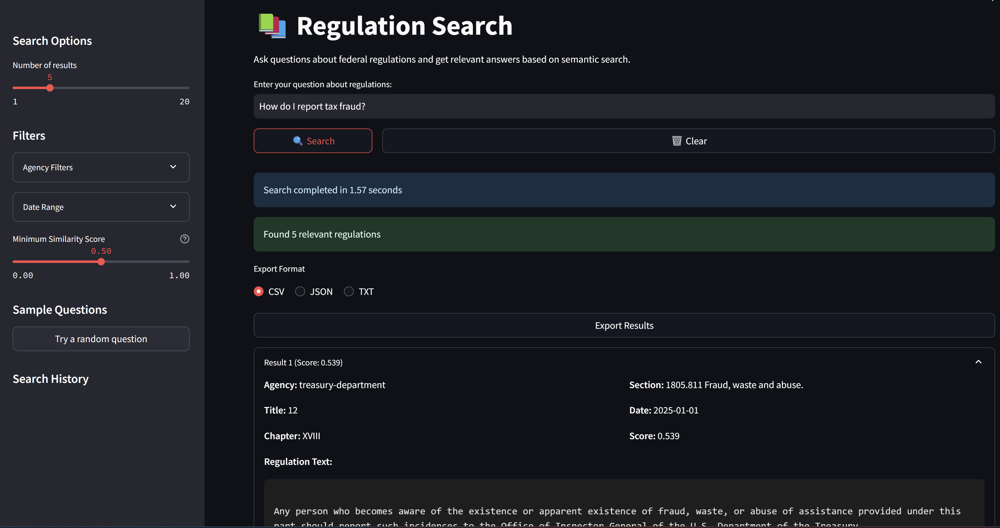

# Application Interface

This document describes the interactive web applications for analyzing and searching federal regulations.


*Federal Regulations Analysis Dashboard showing word count analysis and agency comparisons*

[Screenshot needed: Add a screenshot of the Search Interface showing search results and evaluation features]
*Semantic Search Interface with evaluation features and analytics dashboard*

## Overview

The application suite consists of two Streamlit interfaces:
1. Analysis Dashboard (`streamlit_app.py`)
2. Semantic Search Interface (`streamlit_search.py`)

## Analysis Dashboard

### Running the Dashboard
```bash
streamlit run streamlit_app.py
```

### Features

#### 1. Data Filtering
- **Year Selection**: Filter regulations by year (2017-2025)
- **Agency Selection**: Multi-select agencies to include
- **Data Download**: Export filtered data as CSV

#### 2. Analysis Sections

##### Word Count Analysis
- Total word count by agency
- Average words per agency
- Largest agency identification
- Complexity metrics overview
- Interactive bar charts

##### Complexity Analysis
- Distribution of complexity metrics:
  - Flesch Reading Ease
  - Gunning Fog Index
  - SMOG Index
  - Automated Readability Index
- Box plots with statistical summaries

##### Temporal Analysis
- Metric trends over time
- Agency-specific temporal patterns
- Interactive line charts
- Change analysis summaries

##### Readability Metrics Analysis
- Correlation heatmap
- Metric relationships
- Statistical summaries
- Agency-level comparisons

##### Agency Comparison Analysis
- Direct comparison between two agencies
- Multiple metrics visualization
- Percentage differences
- Detailed comparison tables

### Dashboard Layout
```
├── Header
├── Sidebar
│   ├── Year Filter
│   ├── Agency Selection
│   ├── Data Download
│   └── Analysis Section Selection
└── Main Content
    ├── Visualizations
    ├── Statistics
    ├── Explanatory Text
    └── Interactive Elements
```

## Semantic Search Interface


*Semantic Search Interface with filtering options and results display*

### Running the Search Interface
```bash
streamlit run streamlit_search.py
```

### Features

#### 1. Search Options
- **Results Count**: Adjust number of results (1-20)
- **Agency Filters**: Filter by specific agencies
- **Date Range**: Filter by regulation date
- **Similarity Threshold**: Set minimum similarity score
- **Random Question Generator**: AI-powered question suggestions

#### 2. Search Results
- Relevance scores
- Agency metadata
- Regulation text
- Interactive expandable sections

#### 3. Evaluation Features
- **AI Evaluation**: Automatic relevance and quality assessment
- **Manual Evaluation**: User feedback collection
- **Rating System**:
  - Relevance: Not Relevant to Very Relevant
  - Quality: Poor to Excellent
- **Feedback Collection**: Per-result and overall feedback

#### 4. Analytics Dashboard
- **Query Performance**:
  - Success rates
  - Average relevance scores
  - Quality metrics
- **Feedback Analysis**:
  - Common themes
  - User satisfaction
  - Areas for improvement
- **OpenAI Usage Analytics**:
  - Token usage
  - Cost tracking
  - API performance metrics

#### 5. Export Options
- CSV format
- JSON format
- TXT format
- Analytics data export

#### 6. Search History
- Recent queries list
- One-click rerun
- History clearing
- Performance tracking

### Interface Layout
```
├── Header
├── Sidebar
│   ├── Search Options
│   ├── Filters
│   ├── Random Questions
│   └── Search History
└── Main Content
    ├── Search Bar
    ├── Results Display
    │   ├── Metadata
    │   ├── Text Content
    │   ├── AI Evaluation
    │   └── User Feedback
    ├── Analytics Dashboard
    │   ├── Performance Metrics
    │   ├── Usage Statistics
    │   └── Feedback Analysis
    └── Export Options
```

## Usage Examples

### Analysis Dashboard
```python
# Example: Filtering and analyzing specific agencies
1. Select year range: 2023
2. Choose agencies: "Department of Defense", "Department of Energy"
3. Navigate to "Complexity Analysis"
4. Select "Gunning Fog Index" metric
5. Export filtered data
```

### Search Interface
```python
# Example: Using AI-enhanced search
1. Generate random question or enter custom query
2. Set filters:
   - Minimum similarity: 0.7
   - Agencies: ["Department of Defense", "Department of Homeland Security"]
   - Date range: Last 2 years
3. Get AI evaluations for results
4. Provide manual feedback
5. View analytics dashboard
6. Export results and analysis
```

## Performance Considerations

### Dashboard
- Caches data loading
- Optimizes plot rendering
- Handles large datasets efficiently
- Responsive interface design

### Search Interface
- Fast similarity search using FAISS
- Efficient metadata retrieval
- OpenAI API logging and monitoring
- Evaluation data caching
- Analytics optimization

## Troubleshooting

Common issues and solutions:
1. **Slow Loading**
   - Reduce date range
   - Filter agencies
   - Clear cache

2. **Search Issues**
   - Check minimum similarity score
   - Verify database connection
   - Refresh FAISS index
   - Check OpenAI API status

3. **AI Evaluation Issues**
   - Verify OpenAI API key
   - Check API rate limits
   - Monitor usage logs
   - Clear evaluation cache

4. **Analytics Issues**
   - Check evaluation data files
   - Verify log file access
   - Reset analytics cache

## References

For additional information:
- [Analysis Documentation](Analysis.md)
- [Pipeline Documentation](Pipeline.md)
- [Search Documentation](Search.md)
- [Streamlit Documentation](https://docs.streamlit.io)
- [OpenAI API Documentation](https://platform.openai.com/docs) 